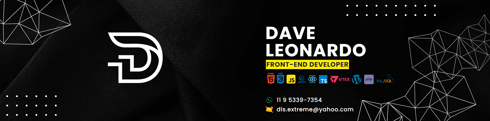

 

# Hello World, eu sou Dave  ☕

### 🌐 Desenvolvedor Front-end | Futuro Fullstack Developer

Com 10 anos de experiência em desenvolvimento web e 5 anos focado na plataforma VTEX, sou apaixonado por e-commerce e inovação. Atualmente, estou finalizando minha graduação em Sistemas para Web e me preparando para uma transição para desenvolvedor Fullstack, com o objetivo de expandir minhas habilidades e contribuir de forma ainda mais significativa em projetos digitais.

🔍 Estou sempre em busca de novos desafios e aprendizados, apaixonado por implementar tecnologias que melhorem a experiência do usuário e impulsionem o crescimento dos negócios.

🎯 Nos próximos meses, minha meta é me tornar um desenvolvedor Fullstack, acompanhando as tendências do mercado e ampliando meu conhecimento em diversas tecnologias.

# Developer skills 💻

### Tecnologias usadas no dia a dia
  

### Ferramentas do dia a dia

### Tecnologias que estou aprendendo

 

# Let's connect 🌐
Vamos conectar e explorar juntos as oportunidades no mundo digital!

  
  

<picture>
  <source media="(prefers-color-scheme: dark)" srcset="https://raw.githubusercontent.com/mari4souza/mari4souza/output/github-contribution-grid-snake-dark.svg">
  <source media="(prefers-color-scheme: light)" srcset="https://raw.githubusercontent.com/mari4souza/mari4souza/output/github-contribution-grid-snake.svg">
  
</picture>
